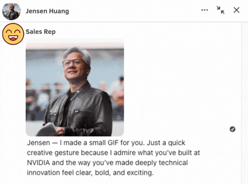
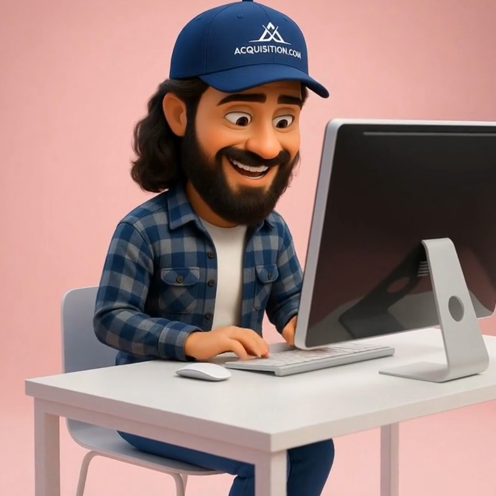
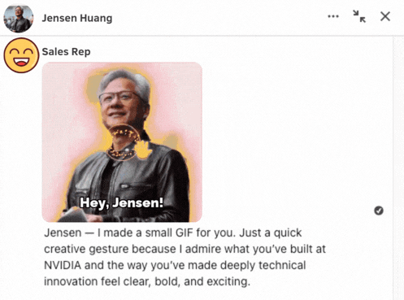
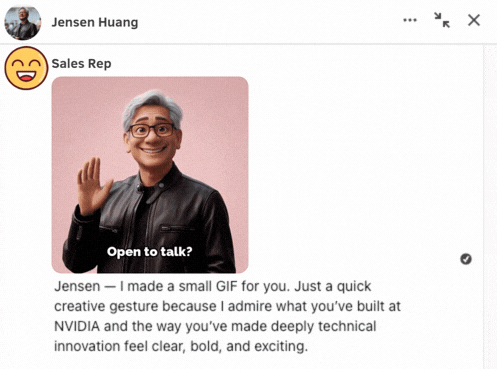
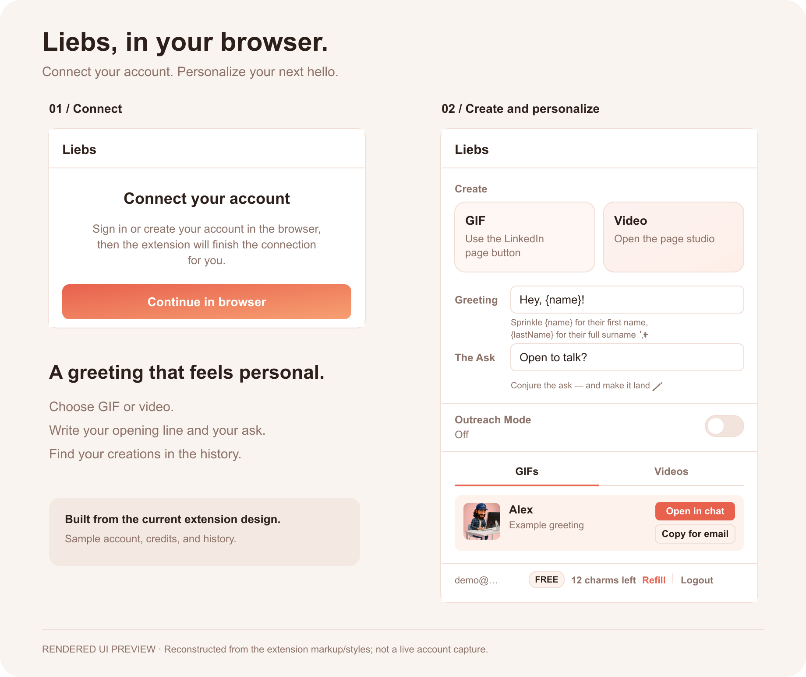

  

  <strong>Turn a LinkedIn profile photo into a personal, animated hello.</strong> 
  Liebs is a Chrome extension for creating cartoon greetings and personalized outreach. 
  Choose a person, add your message, and create something they can watch.

  <a href="#see-it-in-action"><strong>See the examples</strong></a> ·
  <a href="#the-extension">The extension</a> ·
  <a href="#try-it">Install</a> ·
  <a href="docs/backend.md">Developer guide</a>

## See it in action

<table>
  <tr>
    <th width="50%">A personal GIF greeting</th>
    <th width="50%">A cartoon video pitch</th>
  </tr>
  <tr>
    <td align="center" valign="top">
       
      A photo becomes a waving character, with a greeting and a call to action.  
      <a href="docs/assets/liebs-example.gif"><strong>Open the animated GIF →</strong></a>
    </td>
    <td align="center" valign="top">
       
      A 35-second cartoon pitch with audio.  
      <a href="docs/assets/liebs-alex-cartoon-pitch.mp4"><strong>Watch the Alex video →</strong></a>
    </td>
  </tr>
</table>

*Examples supplied by the project owner. The GIF plays inline; select the video preview to open the original MP4. These illustrate the product, rather than verifying the current backend deployment.*

## How you use it

1. **Choose a person.** Open a LinkedIn profile and launch Liebs.
2. **Write your greeting.** Personalize the name, opening line, and call to action.
3. **Create and review.** Generate the media, then use it in your conversation.

For example: **“Hey, Alex!” → a character waves hello → “Open to talk?”**

See the GIF transformation in three frames

| Profile photo | Transformation | Animated greeting |
| :---: | :---: | :---: |
|  |  |  |

Unaltered frames from the example GIF above.

## The extension

  

*Rendered UI previews reconstructed from the current extension design, with sample account, balance, and history data.* [Connection screen](docs/assets/liebs-ui-connect.png) · [Main popup](docs/assets/liebs-ui-create.png)

The included **Liebs GIF Generator** extension brings the controls into the browser:

| Control | What it does |
| :--- | :--- |
| **GIF / Video** | Launch the creation controls on the LinkedIn page. |
| **Greeting / The Ask** | Set your opening line and call to action; use `{name}` or `{lastName}` to personalize them. |
| **GIFs / Videos history** | Find previous creations. |
| **Charms** | See the available credit balance and refill controls. |
| **Outreach Mode** | Request profile pre-processing while you browse. |

The [preview source](docs/ui-preview/README.md) includes editable SVGs and a separate HTML/CSS version for local viewing.

## Try it

1. Download this repository using **Code → Download ZIP**, then extract it.
2. Open `chrome://extensions` in Chrome and enable **Developer mode**.
3. Select **Load unpacked**, then choose the repository’s **`extension/`** folder.
4. Open Liebs and select **Continue in browser** to connect your account.

No extension build step is needed. [Full installation instructions →](extension/README.md#install-in-chrome)

> **Current status:** the extension connects to `liebs.app` and `api.liebs.app`. The backend in this repository is an earlier implementation and does not support every extension feature. Live sign-in and generation have not been verified. [Known issues and next steps →](docs/project-status.md)

## For developers

| In this repository | Start here |
| :--- | :--- |
| **Chrome extension** | [`extension/`](extension/) — the April 18, 2026 package, version 2.0.0. |
| **Backend API** | [`src/`](src/) — accounts, credits, generation jobs, media processing, and monitoring. |
| **Setup and API reference** | [Backend guide](docs/backend.md) — dependencies, environment variables, SQL migrations, and endpoints. |
| **Demo assets** | [`docs/assets/`](docs/assets/) — the supplied GIF, video, and preview images. |

The checked-in GIF pipeline is **photo → AI portrait → animation → render → text + GIF export**, using fal.ai, Replicate, Remotion Lambda, and FFmpeg. Supabase stores accounts and jobs; Stripe provides checkout routes.

The separate Remotion composition and the backend version matching the newer extension still need to be located and versioned. See [project status](docs/project-status.md) for the source inventory and open work.
