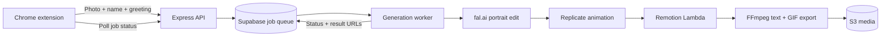

# Backend guide

[← Back to Liebs](../README.md) · [Install the extension](../extension/README.md)

This guide describes the backend checked into this repository. The included extension calls newer live API endpoints that are not all implemented here.

## What's in the backend

| Capability | Implementation |
| :--- | :--- |
| **Accounts** | Email/password signup and login through Supabase, with bearer-token authentication. |
| **Portrait transformation** | fal.ai image editing with a prompt designed to preserve the person's pose, framing, clothing, and recognizable features. |
| **Character animation** | Replicate video generation for a short wave and smile. |
| **Media composition** | Remotion Lambda renders MP4; FFmpeg adds greeting/CTA text and exports the final MP4 and GIF. |
| **Text revisions** | Re-stamp a saved generation's text using its stored MP4, without repeating AI generation. |
| **Background jobs** | A database-backed queue, polling endpoint, configurable worker concurrency, and stale-job handling. |
| **Credits** | One credit deducted when the pipeline starts; a refund is attempted if that pipeline fails. Stripe Checkout routes provide credit-pack purchases. |
| **History and monitoring** | Recent generations, credit transactions, error events, and user/admin reliability summaries. |

These describe the checked-in code. Live service availability and a complete production deployment have not been verified.

## How it works



Supabase also stores accounts, balances, generation history, and errors. Stripe handles checkout. For base64 photo input, the pipeline uploads the original to S3 and attempts background removal; it can render the opening segment while character animation runs.

The current service configuration uses **Grok Imagine image editing through fal.ai** and **Seedance 1 Lite through Replicate**. The renderer expects a deployed Remotion composition named **`Main`**.

### Generation API

Authenticated endpoints use `Authorization: Bearer <Supabase access token>`.

1. Submit a photo and name to `POST /api/generate/pixar-gif`.
2. Save the `jobId` returned with **HTTP 202**.
3. Poll `GET /api/generate/jobs/:id` until `status` is `completed` or `failed`.
4. On completion, use `gifUrl` or `mp4Url`; on failure, inspect `error` and `errorCode`.

Example request body:

```json
{
  "photoBase64": "data:image/jpeg;base64,<image-data>",
  "firstName": "Alex",
  "greeting": "Hey, Alex!",
  "ctaText": "Open to talk?"
}
```

`photoUrl` can be supplied instead of `photoBase64`. Generation requires an available credit. The initial response contains a job reference, not the finished GIF.

<details>
<summary><strong>API reference</strong></summary>

| Method | Endpoint | Purpose |
| :--- | :--- | :--- |
| `GET` | `/health` | Process health response; does not verify upstream services. |
| `POST` | `/api/auth/signup` | Create an account with `email` and `password`. |
| `POST` | `/api/auth/login` | Return account details and an access token. |
| `GET` | `/api/auth/me` | Read the current account and credit balance. |
| `GET` | `/api/credits/packs` | List configured credit packs. |
| `GET` | `/api/credits/balance` | Read the current user's balance. |
| `POST` | `/api/credits/purchase` | Create a checkout session using `packId`. |
| `POST` | `/api/credits/webhook` | Receive Stripe payment events. |
| `GET` | `/api/credits/history` | Read up to 50 recent transactions. |
| `POST` | `/api/generate/pixar-gif` | Queue a generation. |
| `GET` | `/api/generate/jobs/:id` | Read the user's job status and result. |
| `GET` | `/api/generate/history` | Read up to 20 recent generations. |
| `POST` | `/api/generate/generations/:id/restamp-text` | Update a saved GIF using `greeting` and `ctaText`. |
| `GET` | `/api/monitoring/summary` | Read the current user's reliability summary. |
| `GET` | `/api/monitoring/admin/summary` | Read global metrics using `MONITORING_API_KEY`. |

Health, signup, login, and pack listing do not require a user token. The webhook uses a Stripe signature; the admin summary uses `x-monitoring-key` or a bearer monitoring key. Other endpoints above require a user token.

The code also declares a cancellation route, but its worker implementation is incomplete; see the [project status](project-status.md).

</details>

## Getting started

The following setup is for the backend service and its external dependencies. The extension is included in this repository; the Remotion composition is still separate.

### 1. Prepare the services

- Node.js 20 or newer, as required by the locked Supabase and AWS SDK dependencies, and npm.
- FFmpeg and FFprobe available on `PATH`, including FFmpeg's `drawtext` filter.
- A Supabase project with Auth and Postgres.
- fal.ai and Replicate credentials with generation access.
- AWS credentials, accessible S3 storage, and a deployed Remotion Lambda function/site containing **`Main`**.
- Stripe credentials. Use test mode while validating checkout.

The server runs the queue worker in the same process as Express. Use a persistent Node.js process for this implementation.

### 2. Install and configure

```bash
git clone https://github.com/rebempor/linkedin-pixar-backend.git
cd linkedin-pixar-backend
npm ci
cp .env.example .env
```

Fill in `.env` using [`.env.example`](../.env.example). Keep service-role, payment, AI, and AWS secrets on the backend.

| Configuration | Variables |
| :--- | :--- |
| Supabase | `SUPABASE_URL`, `SUPABASE_ANON_KEY`, `SUPABASE_SERVICE_KEY` |
| AI generation | `FAL_API_KEY`, `REPLICATE_API_KEY` |
| Rendering | `REMOTION_AWS_REGION`, `REMOTION_FUNCTION_NAME`, `REMOTION_SERVE_URL` |
| Payments | `STRIPE_SECRET_KEY`, `STRIPE_WEBHOOK_SECRET`, `FRONTEND_URL` |
| Server | `PORT` — defaults to `3000` |
| Admin metrics | `MONITORING_API_KEY` |

AWS authentication uses the SDK's credential chain; `.env.example` also shows the access-key variables. `FRONTEND_URL` supplies the allowed web origin and checkout redirect base; the frontend must provide `/success` and `/cancel` pages.

**Storage setup:** the media services currently contain hard-coded bucket names in [`videoCompress.js`](../src/services/videoCompress.js), [`backgroundRemoval.js`](../src/services/backgroundRemoval.js), and [`textOverlay.js`](../src/services/textOverlay.js). Adapt those values and URL construction to your storage before using a different AWS deployment. Setting the Remotion environment variables alone does not change these buckets.

<details>
<summary><strong>Optional rendering and worker settings</strong></summary>

- `GENERATION_JOB_POLL_MS` — queue polling interval; default `3000`.
- `GENERATION_JOB_WORKER_CONCURRENCY` — concurrent jobs per process; default `4`.
- `GENERATION_JOB_STALE_MINUTES` — stale-processing threshold; default `30`.
- `EFFECTS_OVERLAY_URL` — optional pre-rendered effects overlay.
- `REMOTION_SCALE`, `REMOTION_EVERY_NTH_FRAME`, and the concurrency settings in `.env.example` — render tuning. Set only one chunking strategy: `REMOTION_CONCURRENCY` or `REMOTION_FRAMES_PER_LAMBDA`.
- `GIF_OUTPUT_PROFILE` — `optimized` by default, or `legacy`. Optimized defaults are 360px wide, 8fps, and 96 colors, with additional `GIF_*` overrides in [`videoCompress.js`](../src/services/videoCompress.js).
- `DRAWTEXT_FONT_PATH` — optional absolute font path. To use the bundled font, point it to `fonts/Poppins-Bold.ttf` in your checkout.

</details>

### 3. Initialize the database

Run these SQL files in order in the Supabase SQL editor:

1. [`supabase-schema.sql`](../supabase-schema.sql)
2. [`migrations/20260223_job_queue_and_monitoring.sql`](../migrations/20260223_job_queue_and_monitoring.sql)
3. [`migrations/20260224_add_current_step.sql`](../migrations/20260224_add_current_step.sql)
4. [`migrations/20260224_add_mp4_no_text_url.sql`](../migrations/20260224_add_mp4_no_text_url.sql)

These create the credit ledger, generation history, queue, error tracking, and fields used for text revisions. Signup starts with zero credits. If email confirmation is enabled in Supabase, signup may not immediately return an access token.

### 4. Start the backend

```bash
npm run dev
```

For a regular server process, use `npm start`. Check that it responds:

```bash
curl http://localhost:3000/health
```

A successful health response confirms the HTTP server is running. Validate database access, rendering, and payments separately before relying on a complete generation flow.

## Repository map

```text
extension/                    Complete Liebs Chrome extension package
src/
├── index.js                  Express app and worker startup
├── config/env.js             Supabase configuration and aliases
├── middleware/auth.js        Access-token verification
├── routes/                   Auth, credits, generation, monitoring
└── services/
    ├── generationJobs.js     Database queue and worker
    ├── generationPipeline.js End-to-end generation orchestration
    ├── fal.js                Portrait transformation
    ├── replicate.js          Character animation
    ├── backgroundRemoval.js  Optional silhouette extraction
    ├── remotion.js           Lambda rendering
    ├── textOverlay.js        Text composition and GIF export
    ├── videoCompress.js      Media conversion and uploads
    └── errorTracker.js       Error-event recording
migrations/                   Incremental database changes
fonts/                        Bundled Poppins Bold font
supabase-schema.sql           Base schema and credit functions
.env.example                  Configuration template
```
